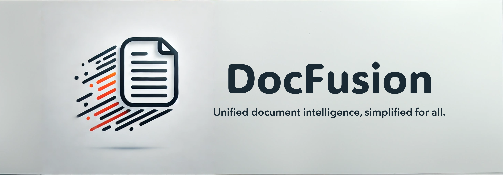

# DocFusion



**DocFusion** is a Python library for deep document visual understanding. It provides a unified interface for a suite of tasks like layout detection, OCR, table extraction, reading order detection, and more. By abstracting the complexities of setting up pipelines across different libraries and models, **DocFusion** makes it easier than ever to integrate and optimize document analysis workflows.

## 🚀 Why DocFusion?

Working with multiple document analysis tools can be challenging due to differences in APIs, outputs, and data formats. **DocFusion** addresses these pain points by:

- **Unifying APIs:** A consistent interface for all tasks, irrespective of the underlying library or model.
- **Pipeline Optimization:** Pre-built, customizable pipelines for end-to-end document processing.
- **Interoperability:** Smooth integration of outputs from different models into cohesive workflows.
- **Ease of Use:** Focus on high-level functionality without worrying about the underlying complexities.

## ✨ Features

- **Layout Detection:** Identify the structure of documents with popular models and tools.
- **OCR:** Extract text from images or scanned PDFs with support for multiple OCR engines.
- **Table Extraction:** Parse and extract data from tables in documents.
- **Reading Order Detection:** Determine the logical reading sequence of elements.
- **Custom Pipelines:** Easily configure and extend pipelines to meet specific use cases.
- **Scalability:** Built to handle large-scale document processing tasks.

Here’s the updated and more detailed installation section:

---

## 🔧 Installation

### Prerequisites

- Python 3.11 or higher
- `pip` package manager
- **Optional (for GPU support)**: A compatible NVIDIA GPU with CUDA 12.1

### Setting Up Your Environment

To set up your environment, you can choose one of the following methods:

1. **Using `conda`**:
   ```bash
   conda create -n docfusion python=3.11
   conda activate docfusion
   ```

2. **Using `venv`**:
   ```bash
   python3 -m venv docfusion
   source docfusion/bin/activate  # For Linux/macOS
   .\docfusion\Scripts\activate   # For Windows
   ```

3. **Using `poetry`**:
   ```bash
   poetry new docfusion
   cd docfusion
   poetry install
   ```

### Installing PyTorch

To install PyTorch, choose one of the following options based on whether you want GPU support:

- **With GPU support (CUDA 12.1)**:
   ```bash
   pip install torch torchvision torchaudio --index-url https://download.pytorch.org/whl/cu121
   ```

- **Without GPU support**:
   ```bash
   pip install torch torchvision torchaudio
   ```

### Installing DocFusion

Once your environment is set up and PyTorch is installed, you can install DocFusion:

1. **From PyPI**:
   ```bash
   pip install docfusion-ai
   ```

2. **From source**:
   If you prefer to install directly from the source, you can use the following command:
   ```bash
   pip install -e .
   ```

## 🛠️ Getting Started

Here's a quick example to demonstrate the power of **DocFusion**:

```python
from docfusion import DocFusion

# Initialize DocFusion
docfusion = DocFusion()

# Load a document
doc = docfusion.load_document("sample.pdf")
# Load a images
# doc = docfusion.load_image("sample.png")

# Detect layout
layout = docfusion.detect_layout(doc)

# Perform OCR
text = docfusion.extract_text(doc)

# Extract tables
tables = docfusion.extract_tables(doc)

# Print results
print("Layout:", layout)
print("Text:", text)
print("Tables:", tables)

```

<h3>📚 Supported Models and Libraries</h3>

DocFusion integrates seamlessly with a variety of popular tools, including:

<details>
  <summary><h3>Layout Detection</h3></summary>
  
  <table border="1" cellpadding="5" cellspacing="0" style="width:100%; border-collapse: collapse;">
      <thead>
          <tr>
              <th>Name</th>
              <th>Info</th>
              <th>Link</th>
              <th>LICENSE</th>
          </tr>
      </thead>
      <tbody>
          <tr>
              <td><strong>DocLayout-YOLO</strong></td>
              <td>Document layout detection model based on YOLOv10</td>
              <td><a href="https://github.com/opendatalab/DocLayout-YOLO" target="_blank">DocLayout-YOLO</a></td>
              <td><a href="https://github.com/opendatalab/DocLayout-YOLO/blob/main/LICENSE" target="_blank">AGPL-3.0</a></td>
          </tr>
      </tbody>
  </table>

</details>


## 🏗️ How It Works

**DocFusion** organizes document processing tasks into modular components. Each component corresponds to a specific task and offers:

1. **A Unified Interface:** Consistent input and output formats.
2. **Model Independence:** Switch between libraries or models effortlessly.
3. **Pipeline Flexibility:** Combine components to create custom workflows.

## 📈 Roadmap

- Add support for semantic understanding tasks (e.g., entity extraction).
- Integrate pre-trained transformer models for context-aware document analysis.
- Expand pipelines for multilingual document processing.
- Add CLI support for batch processing.

## 🤝 Contributing

We welcome contributions to **DocFusion**! Here's how you can help:

1. Fork the repository.
2. Create a new branch for your feature or bug fix.
3. Commit your changes and open a pull request.

For more details, refer to our [CONTRIBUTING.md](https://www.notion.so/CONTRIBUTING.md).

## 🛡️ License

This project is licensed under multiple licenses, depending on the models and libraries you use in your pipeline. Please refer to the individual licenses of each component for specific terms and conditions.

## 🌟 Support the Project

If you find **DocFusion** helpful, please give us a ⭐ on GitHub and share it with others in the community.

## 🗨️ Join the Community

For discussions, questions, or feedback:

- **Issues:** Report bugs or suggest features [here](https://github.com/adithya-s-k/DocFusion/issues).
- **Email:** Reach out at adithyaskolavi@gmail.com
