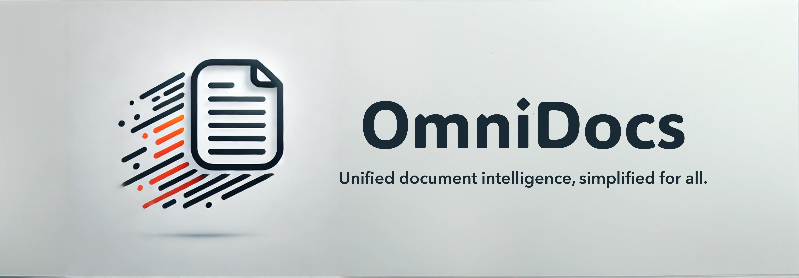

# OmniDocs



**OmniDocs** is a powerful framework that simplifies document understanding and analysis. It provides a unified, production-ready interface for essential document processing tasks including:

- Layout Analysis & Detection
- OCR & Text Extraction
- Table Detection & Extraction
- Reading Order Detection
- Document Understanding & Analysis

By abstracting away the complexities of integrating multiple libraries and models, **OmniDocs** enables developers to build robust document processing workflows with minimal effort. Whether you're working with academic papers, business documents, or complex technical materials, OmniDocs provides the tools you need to extract, analyze, and understand document content efficiently.
<!-- 
## 📚 Tasks

✅ Layout Detection
⏳ Text Detection and Extraction
⏳ OCR (Optical Character Recognition)
⏳ Table Extraction
⏳ Reading Order Detection
⏳ Image Captioning
⏳ Chart Understanding
⏳ Math Expression Recognition
⏳ One Stage Document Understanding
⏳ Multi Modal Document Understanding (Vision Language Models)


## Workflows
⏳ PDF to Markdown -->

## 🔧 Installation

### Prerequisites

- Python 3.11 or higher
- `pip` package manager
- **Optional (for GPU support)**: A compatible NVIDIA GPU with CUDA 12.1

### Setting Up Your Environment

To set up your environment, you can choose one of the following methods:

1. **Using `conda`**:
   ```bash
   conda create -n omnidocs python=3.11
   conda activate omnidocs
   ```

2. **Using `venv`**:
   ```bash
   python3 -m venv omnidocs
   source omnidocs/bin/activate  # For Linux/macOS
   .\omnidocs\Scripts\activate   # For Windows
   ```

3. **Using `poetry`**:
   ```bash
   poetry new omnidocs
   cd omnidocs
   poetry install
   ```

### Installing PyTorch

To install PyTorch, choose one of the following options based on whether you want GPU support:

- **With GPU support (CUDA 12.1)**:
   ```bash
   pip install torch torchvision torchaudio --index-url https://download.pytorch.org/whl/cu121
   ```

- **Without GPU support**:
   ```bash
   pip install torch torchvision torchaudio
   ```

### Installing OmniDocs

Once your environment is set up and PyTorch is installed, you can install OmniDocs:

1. **From PyPI**:
   ```bash
   pip install omnidocs
   ```

2. **From source**:
   If you prefer to install directly from the source, you can use the following command:
   ```bash
   pip install -e .
   ```

## 🛠️ Getting Started

Here's a quick example to demonstrate the power of **OmniDocs**:

```python
tutorial coming soon
```

<h3>📚 Supported Models and Libraries</h3>

OmniDocs integrates seamlessly with a variety of popular tools, including:

- ✅ : working and tested
- ⏳ : planned/in-progress support
- ❌ : no support

<details>
  <summary><h3>Layout Analysis</h3></summary>
  
   <table border="1" cellpadding="5" cellspacing="0" style="width:100%; border-collapse: collapse;">
      <thead>
         <tr>
               <th>Detection Model</th>
               <th>Source</th>
               <th>License</th>
               <th>CPU</th>
               <th>GPU</th>
               <th>Info</th>
         </tr>
      </thead>
      <tbody>
         <tr>
               <td><strong>✅DocLayout YOLO</strong></td>
               <td><a href="https://github.com/opendatalab/DocLayout-YOLO" target="_blank">GitHub - DocLayout-YOLO</a></td>
               <td><a href="https://github.com/opendatalab/DocLayout-YOLO/blob/main/LICENSE" target="_blank">AGPL-3.0</a></td>
               <td>⏳</td>
               <td>✅</td>
               <td>A robust layout detection model based on YOLO-v10, designed for diverse document types.</td>
         </tr>
         <tr>
               <td><strong>✅PPStructure (Paddle OCR)</strong></td>
               <td><a href="https://github.com/PaddlePaddle/PaddleOCR" target="_blank">GitHub - PaddleOCR</a></td>
               <td><a href="https://github.com/PaddlePaddle/PaddleOCR/blob/release/2.6/LICENSE" target="_blank">Apache 2.0</a></td>
               <td>✅</td>
               <td>✅</td>
               <td>An OCR tool that supports multiple languages and provides layout detection capabilities.</td>
         </tr>
         <tr>
               <td><strong>✅RT DETR (Docling)</strong></td>
               <td><a href="https://github.com/topics/rt-detr" target="_blank">GitHub - RT-DETR</a></td>
               <td><a href="https://opensource.org/licenses/MIT" target="_blank">MIT</a></td>
               <td>⏳</td>
               <td>✅</td>
               <td>Implementation of RT-DETR, a real-time detection transformer focusing on object detection tasks.</td>
         </tr>
         <tr>
               <td><strong>✅Florence-2-DocLayNet-Fixed</strong></td>
               <td><a href="https://huggingface.co/yifeihu/Florence-2-DocLayNet-Fixed" target="_blank">Hugging Face - Florence-2-DocLayNet-Fixed</a></td>
               <td><a href="https://opensource.org/licenses/MIT" target="_blank">MIT</a></td>
               <td>❌</td>
               <td>✅</td>
               <td>Fine-tuned model for document layout analysis, improving bounding box accuracy in document images.</td>
         </tr>
         <tr>
               <td><strong>✅Surya Layout</strong></td>
               <td><a href="https://github.com/VikParuchuri/surya" target="_blank">GitHub - Surya</a></td>
               <td><a href="https://www.gnu.org/licenses/gpl-3.0.html" target="_blank">GPL-3.0-or-later</a></td>
               <td>✅</td>
               <td>✅</td>
               <td>OCR and layout analysis tool supporting 90+ languages, including reading order and table recognition.</td>
         </tr>
         <tr>
               <td><strong>⏳Layout LM V3</strong></td>
               <td><a href="https://huggingface.co/microsoft/layoutlmv3-base" target="_blank">Hugging Face - LayoutLMv3</a></td>
               <td><a href="https://creativecommons.org/licenses/by-nc-sa/4.0/" target="_blank">CC BY-NC-SA 4.0</a></td>
               <td>⏳</td>
               <td>⏳</td>
               <td>A pre-trained multimodal Transformer for Document AI, effective for various document understanding tasks.</td>
         </tr>
         <tr>
               <td><strong>⏳Fast / Faster R CNN / MR CNN</strong></td>
               <td><a href="https://github.com/rbgirshick/py-faster-rcnn" target="_blank">GitHub - Faster R-CNN</a></td>
               <td><a href="https://opensource.org/licenses/MIT" target="_blank">MIT</a></td>
               <td>⏳</td>
               <td>⏳</td>
               <td>A library implementing the Faster R-CNN architecture for object detection, widely used in layout tasks.</td>
         </tr>
      </tbody>
   </table>

</details>

<details>
  <summary><h3>Text Extraction</h3></summary>
  
   <table border="1" cellpadding="5" cellspacing="0" style="width:100%; border-collapse: collapse;">
      <thead>
         <tr>
               <th>Extraction Libraries</th>
               <th>Source</th>
               <th>License</th>
               <th>CPU</th>
               <th>GPU</th>
               <th>Info</th>
         </tr>
      </thead>
      <tbody>
         <tr>
         <td>PyPDF2</td>
         <td><a href="https://github.com/py-pdf/PyPDF2" target="_blank">GitHub - PyPDF2</a></td>
         <td><a href="https://github.com/py-pdf/pypdf?tab=License-1-ov-file#readme" target="_blank">MIT</a></td>
         <td>✅</td>
         <td>✅</td>
         <td>A library for extracting text from PDFs.</td>
         </tr>
         <tr>
         <td>PyMuPDF</td>
         <td><a href="https://github.com/pymupdf/PyMuPDF" target="_blank">GitHub - PyMuPDF</a></td>
         <td><a href="https://github.com/pymupdf/PyMuPDF?tab=AGPL-3.0-1-ov-file#readme" target="_blank">MIT</a></td>
         <td>✅</td>
         <td>✅</td>
         <td>A library for extracting text from PDFs.</td>
         </tr>
         <tr>
         <td>pdfplumber</td>
         <td><a href="https://github.com/jsvine/pdfplumber" target="_blank">GitHub - pdfplumber</a></td>
         <td><a href="https://github.com/jsvine/pdfplumber?tab=MIT-1-ov-file#readme" target="_blank">MIT</a></td>
         <td>✅</td>
         <td>✅</td>
         <td>A library for extracting text from PDFs.</td>
         </tr>
         <td>Docling Parse</td>
         <td><a href="https://github.com/DS4SD/docling-parse" target="_blank">GitHub - Docling</a></td>
         <td><a href="https://opensource.org/licenses/MIT" target="_blank">MIT</a></td>
         <td>⏳</td>
         <td>⏳</td>
         <td>A library for extracting text from PDFs.</td>
      </tbody>
   </table>

</details>

<details>
<summary><h3>OCR</h3></summary>
<table border="1" cellpadding="5" cellspacing="0" style="width:100%; border-collapse: collapse;">
      <thead>
         <tr>
               <th>OCR Library</th>
               <th>Source</th>
               <th>License</th>
               <th>CPU</th>
               <th>GPU</th>
               <th>Info</th>
         </tr>
      </thead>
      <tbody>
         <tr>
         <td>Paddle OCR</td>
         <td><a href="https://github.com/PaddlePaddle/PaddleOCR" target="_blank">GitHub - PaddleOCR</a></td>
         <td><a href="https://github.com/PaddlePaddle/PaddleOCR/blob/release/2.6/LICENSE" target="_blank">Apache 2.0</a></td>
         <td>✅</td>
         <td>✅</td>
         <td>An OCR tool that supports multiple languages and provides layout detection capabilities.</td>
         </tr>
         <tr>
         <td>Tesseract</td>
         <td><a href="https://github.com/tesseract-ocr/tesseract" target="_blank">GitHub - Tesseract</a></td>
         <td><a href="https://opensource.org/licenses/BSD-3-Clause" target="_blank">BSD-3-Clause</a></td>
         <td>✅</td>
         <td>✅</td>
         <td>An open-source OCR engine that supports multiple languages and is widely used for text extraction from images.</td>
         </tr>
         <tr>
         <td>EasyOCR</td>
         <td><a href="https://github.com/JaidedAI/EasyOCR" target="_blank">GitHub - EasyOCR</a></td>
         <td><a href="https://opensource.org/licenses/MIT" target="_blank">MIT</a></td>
         <td>✅</td>
         <td>✅</td>
         <td>A simple and easy-to-use OCR library that supports multiple languages and is built on PyTorch.</td>
         </tr>
      </tbody>
</table>


</details>

<details>
  <summary><h3>Table Extraction</h3></summary>
  
   <table border="1" cellpadding="5" cellspacing="0" style="width:100%; border-collapse: collapse;">
      <thead>
         <tr>
               <th>Extraction Libraries/Models</th>
               <th>Source</th>
               <th>License</th>
               <th>CPU</th>
               <th>GPU</th>
               <th>Info</th>
         </tr>
         </thead>
         <tbody>
         <tr>
         <td>PPStructure (Paddle OCR)</td>
         <td><a href="https://github.com/PaddlePaddle/PaddleOCR" target="_blank">GitHub - PaddleOCR</a></td>
         <td><a href="https://github.com/PaddlePaddle/PaddleOCR/blob/release/2.6/LICENSE" target="_blank">Apache 2.0</a></td>
         <td>✅</td>
         <td>✅</td>
         <td>An OCR tool that supports multiple languages and provides layout detection capabilities.</td>
         </tr>
         <tr>
         <td>Camelot</td>
         <td><a href="https://github.com/camelot-dev/camelot" target="_blank">GitHub - Camelot</a></td>
         <td><a href="https://github.com/camelot-dev/camelot/blob/main/LICENSE" target="_blank">MIT</a></td>
         <td>✅</td>
         <td>✅</td>
         <td>A Python library for extracting tables from PDFs.</td>
         </tr>
         <tr>
         <td>Tabula</td>
         <td><a href="https://github.com/tabulapdf/tabula" target="_blank">GitHub - Tabula</a></td>
         <td><a href="https://github.com/tabulapdf/tabula/blob/master/LICENSE" target="_blank">MIT</a></td>
         <td>✅</td>
         <td>✅</td>
         <td>A tool for extracting tables from PDFs.</td>
         </tr>
         <tr>
         <td>Table Transformer</td>
         <td><a href="https://github.com/microsoft/table-transformer" target="_blank">GitHub - Table Transformer</a></td>
         <td><a href="https://github.com/microsoft/table-transformer/blob/main/LICENSE" target="_blank">MIT</a></td>
         <td>⏳</td>
         <td>⏳</td>
         <td>A transformer model for table extraction.</td>
         </tr>
         <tr>
         <td>TableFormer (Docling)</td>
         <td><a href="https://github.com/DS4SD/docling-ibm-models" target="_blank">GitHub - Docling</a></td>
         <td><a href="https://opensource.org/licenses/MIT" target="_blank">MIT</a></td>
         <td>⏳</td>
         <td>⏳</td>
         <td>A transformer model for table extraction.</td>
         </tr>
         </tbody>
   </table>

</details>


## 🏗️ How It Works

**OmniDocs** organizes document processing tasks into modular components. Each component corresponds to a specific task and offers:

1. **A Unified Interface:** Consistent input and output formats.
2. **Model Independence:** Switch between libraries or models effortlessly.
3. **Pipeline Flexibility:** Combine components to create custom workflows.

## 📈 Roadmap

- Add support for semantic understanding tasks (e.g., entity extraction).
- Integrate pre-trained transformer models for context-aware document analysis.
- Expand pipelines for multilingual document processing.
- Add CLI support for batch processing.

## 🤝 Contributing

We welcome contributions to **OmniDocs**! Here's how you can help:

1. Fork the repository.
2. Create a new branch for your feature or bug fix.
3. Commit your changes and open a pull request.

For more details, refer to our [CONTRIBUTING.md](https://www.notion.so/CONTRIBUTING.md).

## 🛡️ License

This project is licensed under multiple licenses, depending on the models and libraries you use in your pipeline. Please refer to the individual licenses of each component for specific terms and conditions.

## 🌟 Support the Project

If you find **OmniDocs** helpful, please give us a ⭐ on GitHub and share it with others in the community.

## 🗨️ Join the Community

For discussions, questions, or feedback:

- **Issues:** Report bugs or suggest features [here](https://github.com/adithya-s-k/OmniDocs/issues).
- **Email:** Reach out at adithyaskolavi@gmail.com
